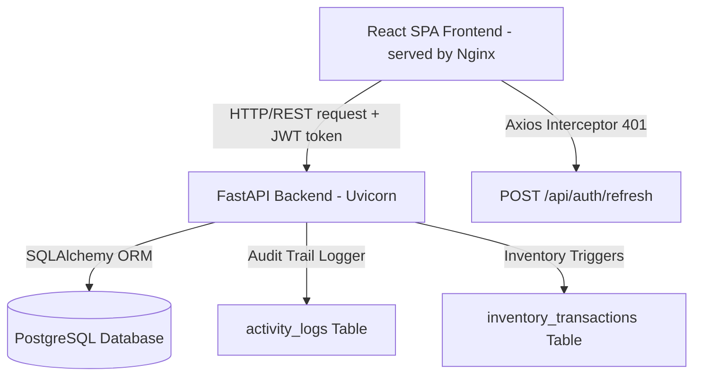
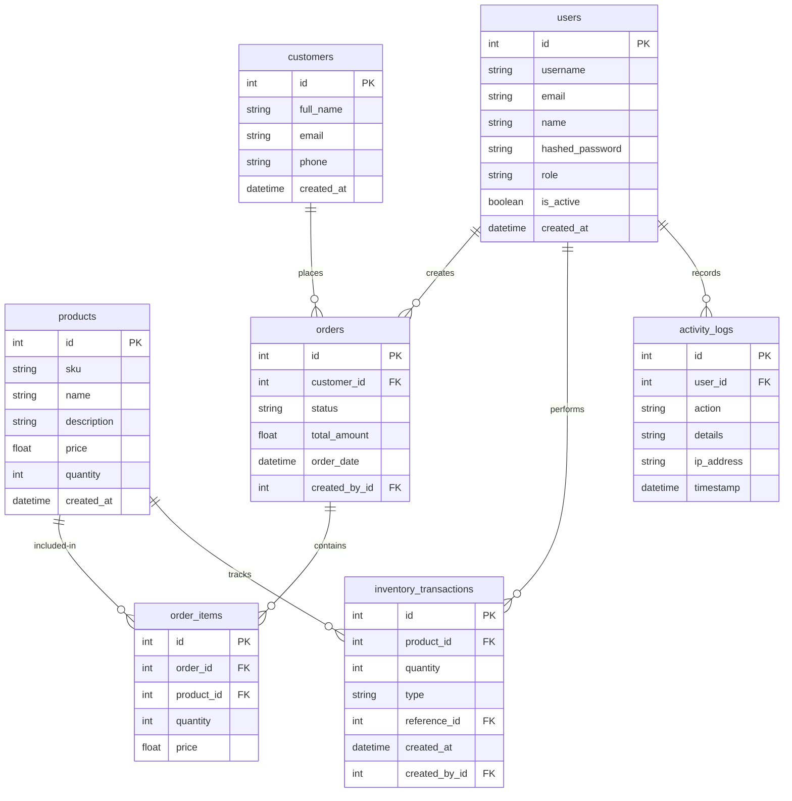

# TraceHub — Containerized Inventory & Order Management System

TraceHub is a production-ready, enterprise-grade full-stack Inventory & Order Management System featuring secure Multi-layered JWT Authentication and Role-Based Access Control (RBAC). 

**Made by: Pushpendra**

---

## 🏗️ System Architecture

The following diagram illustrates the flow of requests and component interactions:



---

## 📊 Database Schema (ER Diagram)

TraceHub uses a relational PostgreSQL database structure optimized for transaction safety, locking, and history auditing:



---

## 🔒 Security & Role-Based Access Matrix

TraceHub restricts operations based on user authentication tokens and role classifications:

| Action | Admin | Manager | Staff |
| :--- | :---: | :---: | :---: |
| **Manage Users (CRUD)** | ✅ Yes | ❌ No | ❌ No |
| **View Security Logs** | ✅ Yes | ❌ No | ❌ No |
| **Delete Products / Customers** | ✅ Yes | ❌ No | ❌ No |
| **Delete Orders** | ✅ Yes | ❌ No | ❌ No |
| **Create / Edit Products** | ✅ Yes | ✅ Yes | ❌ No |
| **Create / Edit Customers** | ✅ Yes | ✅ Yes | ❌ No |
| **Create Orders** | ✅ Yes | ✅ Yes | ✅ Yes |
| **Update Order Statuses** | ✅ Yes | ✅ Yes | ❌ No |
| **View Dashboard & Catalog** | ✅ Yes | ✅ Yes | ✅ Yes |

---

## 🔑 Demo Seed Credentials

The database is seeded automatically with three credentials on startup. Developer login buttons are provided on the login page for instant validation:

1. **Admin User (Full Access)**
   - **Username**: `pushpendra`
   - **Password**: `adminpassword123`
   - **Full Name**: `Pushpendra`
2. **Manager User**
   - **Username**: `manager`
   - **Password**: `managerpassword123`
   - **Full Name**: `Jane Manager`
3. **Staff User**
   - **Username**: `staff`
   - **Password**: `staffpassword123`
   - **Full Name**: `John Staff`

---

## 🚀 Running Locally with Docker Compose

To boot the entire full-stack system, database, and configurations automatically, execute:

```bash
docker-compose up --build
```

- **Frontend client Console**: Accessible at [http://localhost:3000](http://localhost:3000)
- **FastAPI API Swagger Docs**: Accessible at [http://localhost:8000/docs](http://localhost:8000/docs)
- **PostgreSQL Database**: Port `5432`

---

## 🌐 Enterprise Cloud Deployment Guide

### 1. Backend API (Railway)
1. Login to [Railway.app](https://railway.app/).
2. Click **New Project** -> **Deploy from GitHub repo**.
3. Select your repository containing the backend.
4. Add a **PostgreSQL Database** service inside your project.
5. Railway will automatically inject `DATABASE_URL` settings.
6. Configure the following environment variables on the backend container:
   - `DB_USER`
   - `DB_PASSWORD`
   - `DB_HOST`
   - `DB_PORT`
   - `DB_NAME`
   - `SECRET_KEY` (Generate a secure key)
   - `REFRESH_SECRET_KEY`
   - `CORS_ORIGINS` (Set to your frontend deployment URL)
7. Deploy the backend service. It will run migrations automatically.

### 2. Frontend React Client (Netlify)
1. Login to [Netlify](https://www.netlify.com/).
2. Click **Add new site** -> **Import an existing project** from GitHub.
3. Select the repository. Set **Base directory** to `frontend`.
4. Set **Build command** to `npm run build` and **Publish directory** to `frontend/dist`.
5. Set environment variable:
   - `VITE_API_URL` -> Set to your Railway backend URL (e.g. `https://your-backend.up.railway.app`).
6. Because Netlify handles single-page routers (React Router), add a file named `_redirects` in the frontend `public/` directory containing:
   ```text
   /*   /index.html   200
   ```
7. Click **Deploy site**.
